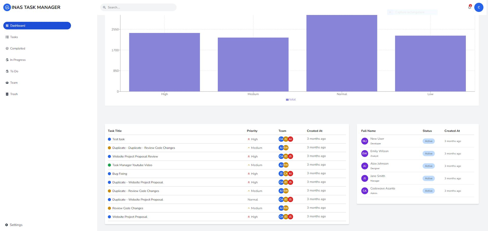
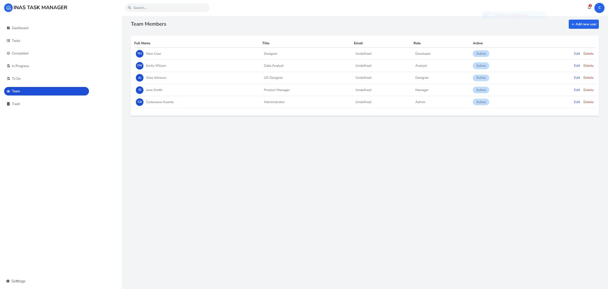
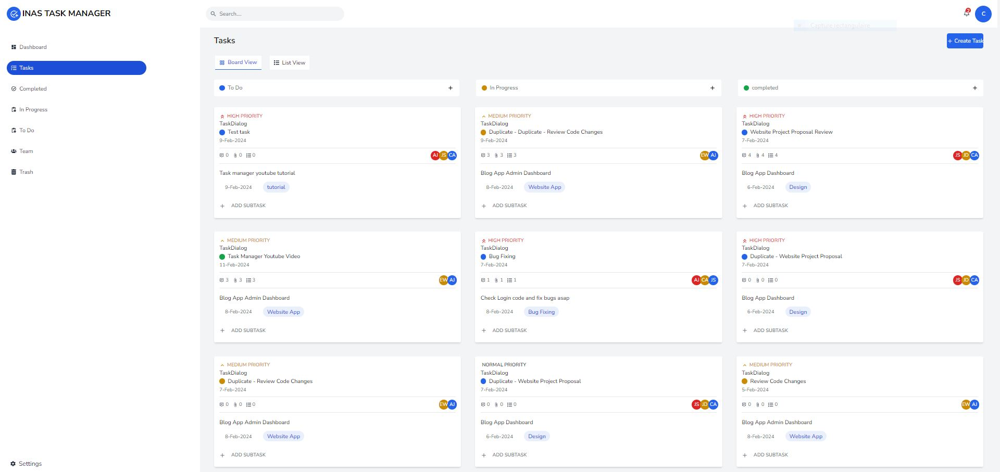
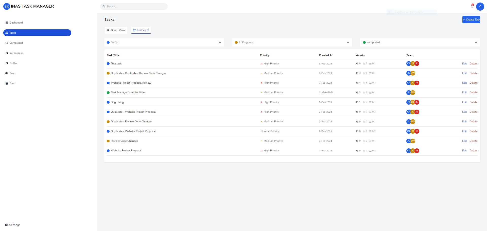
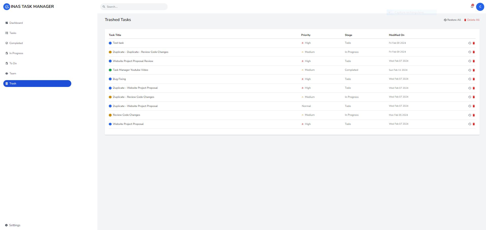

## Overview

Task Manager is a cloud-based web application designed to streamline team task management.  this platform provides a user-friendly interface for efficient task assignment, tracking, and collaboration. Whether you're an administrator or a regular user, Task Manager offers comprehensive features to enhance productivity and organization.

## Key Features

- **Dashboard**:
  - Stay on top of task activities with the ability to add comments
    
- **User Management**:
  - Effortlessly create and manage team accounts, control access, and permissions.
    
- **Task Assignment**:
  - Assign tasks to individual or multiple users, update task details, and track status.
    
- **Task Properties**:
  - Label tasks, assign priority levels, manage sub-tasks, and upload task assets.
    
- **Trash**:
  - Easily recover deleted tasks or items from the Trash.
    

## About Us

Our mission is to provide an innovative solution to project management challenges. Task Manager was inspired by the need for efficient task management within teams. As developers, we understand the importance of organization and collaboration in project workflows. Task Manager was developed to address these needs, providing a seamless experience for administrators and users alike.

## Project Link
[Task Manager GitHub Repository]([https://github.com/devachref/TaskManager])
